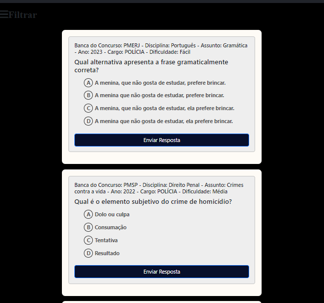

# Quiz com Questões do JSON

Este é um aplicativo web de quiz que permite aos usuários filtrar e responder questões de um arquivo JSON. As questões são geradas automaticamente usando Google's Generative AI e são exibidas na interface do usuário para o usuário responder.

## Funcionalidades

- Carrega questões do arquivo JSON.
- Permite filtrar as questões por disciplina, assunto e cargo.
- Exibe o quiz com as questões filtradas.
- Permite que o usuário responda às questões e veja sua pontuação.

## Estrutura de Arquivos

- `index.html`: Contém a estrutura HTML para a interface do usuário do quiz.
- `script.js`: Contém o código JavaScript responsável por carregar, filtrar e exibir questões, bem como processar respostas do usuário.
- `styles.css`: Contém estilos CSS personalizados para a interface do usuário.
- `questoes.json`: Arquivo JSON que armazena as questões geradas.

## Como Usar

1. Abra o arquivo `index.html` em um navegador da web.
2. Você verá a interface do usuário do quiz, onde pode selecionar disciplina, assunto e cargo para filtrar questões.
3. Clique no botão "Filtrar" para exibir questões de acordo com os critérios selecionados.
4. Responda às questões selecionando uma alternativa e clicando em "Enviar Resposta".
5. A pontuação será exibida na parte superior da página.
6. Você também pode clicar no botão "Ver pontuação" para mostrar ou ocultar a pontuação.

## Dependências

- [Bootstrap](https://getbootstrap.com/): Framework CSS para estilização.
- [Font Awesome](https://fontawesome.com/): Biblioteca de ícones.
- [@google/generative-ai](https://www.npmjs.com/package/@google/generative-ai): Biblioteca para geração de questões com inteligência artificial.

## Exemplo de Interface

## Site

Este projeto não está atualmente hospedado em um site, mas você pode baixar o repositório e executá-lo localmente seguindo as instruções acima.

## Autor

- [Regy Robson Felipe]()

## Site

- [site](https://regyfelipe.github.io/questoesJson/)

## Licença

Este projeto é licenciado sob a [Licença MIT](LICENSE).

